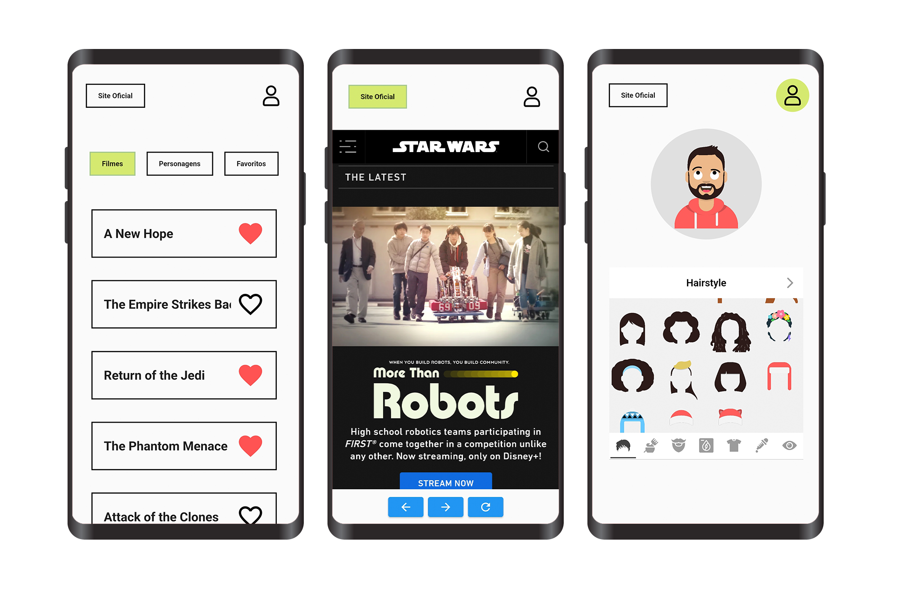

&nbsp;&nbsp;
&nbsp;&nbsp;
&nbsp;&nbsp;

# Star Wars App

## Dependencies

     
 Click to expand 

* [flutter_svg](https://pub.dev/packages/flutter_svg)
* [http](https://pub.dev/packages/http)
* [provider](https://pub.dev/packages/provider)
* [sqflite](https://pub.dev/packages/sqflite)
* [flutter_inappwebview](https://pub.dev/packages/flutter_inappwebview)
* [fluttermoji](https://pub.dev/packages/fluttermoji)

# execute project

> Step 1 - Open cmd and type the command 'git clone https://github.com/RodrigoLima96/star_wars_app'.

> Step 2 - Type command 'cd star_wars_app' (open folder where the project was downloaded).

> Step 3 - Type command 'flutter pub get' (Download all dependencies).

> Step 4 - Type command 'flutter run' (Run the project directly)

OR

> Step 4 - Type command 'code .' (Shortcut to open VsCode) or open the project folder manually.

> Step 5 - Run the project on a device or emulator.

# App Demo

 

    <a href="https://drive.google.com/file/d/1fdE3Hlx6kf8VfDee_Fwpg2b07a3ZYLa4/view?usp=sharing" target="_blank"></img></a>
  
